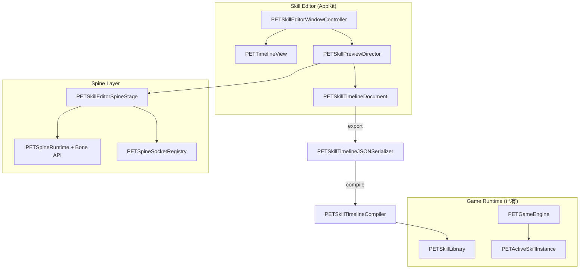

# 2D 技能演出编辑器（Skill Timeline Editor）架构设计

> **技术栈**：Objective-C · Cocoa/AppKit · macOS · Spine Runtime（复用现有 `PETSpineRuntime`）  
> **定位**：人物 Spine 动作 + 技能特效 + 时间轴 的融合编辑工具，导出 JSON 供 `PETGameEngine` 运行时播放。

---

## 目录

1. [工程目录结构](#1-工程目录结构)
2. [核心类设计](#2-核心类设计)
3. [Timeline 数据结构](#3-timeline-数据结构)
4. [JSON Schema](#4-json-schema)
5. [Spine Runtime 接口扩展](#5-spine-runtime-接口扩展)
6. [技能系统架构](#6-技能系统架构)
7. [AppKit UI 结构](#7-appkit-ui-结构)
8. [关键 Objective-C 代码](#8-关键-objective-c-代码)
9. [Timeline 渲染实现](#9-timeline-渲染实现)
10. [JSON 导出与编译](#10-json-导出与编译)
11. [Hitbox 可视化编辑](#11-hitbox-可视化编辑)
12. [实施路线图](#12-实施路线图)
13. [性能要求](#13-性能要求)
14. [扩展预留](#14-扩展预留)
15. [与现有工程对接](#15-与现有工程对接)

---

## 1. 工程目录结构

```text
DesktopPet.xcodeproj
├── DesktopPet/                          # 现有运行时 App
│   ├── GameEngine/                      # 已有，编辑器复用
│   ├── Services/PETSpineRuntime.*       # 扩展 Bone/Socket API
│   └── Resources/Skills/                # 编译产物可写入此处
│
└── DesktopPetSkillEditor/               # ★ 新 Target（AppKit 工具）
    ├── App/
    │   ├── PETSkillEditorAppDelegate.h/.m
    │   └── PETSkillEditorDocumentController.h/.m
    │
    ├── Model/                           # 纯数据，无 UI
    │   ├── Timeline/
    │   │   ├── PETSkillTimelineDocument.h/.m
    │   │   ├── PETSkillTimelineTrack.h/.m
    │   │   ├── PETSkillTimelineClip.h/.m
    │   │   ├── PETSkillTimelineKeyframe.h/.m
    │   │   └── PETSkillTimelineEnums.h
    │   ├── Assets/
    │   │   ├── PETSkillEditorAssetCatalog.h/.m
    │   │   ├── PETFXAssetDefinition.h/.m
    │   │   └── PETShaderAssetDefinition.h/.m
    │   └── Compiler/
    │       ├── PETSkillTimelineCompiler.h/.m      # → PETSkillDefinition
    │       └── PETSkillTimelineJSONSerializer.h/.m
    │
    ├── Spine/                           # 预览专用 Spine 层
    │   ├── PETSpineBoneTransform.h/.m
    │   ├── PETSpineSocketRegistry.h/.m
    │   └── PETSkillEditorSpineStage.h/.m           # 封装 MetalView + scrub
    │
    ├── Preview/                         # 演出合成
    │   ├── PETSkillPreviewDirector.h/.m           # 60fps 驱动
    │   ├── PETFXInstance.h/.m
    │   ├── PETHitboxOverlayLayer.h/.m
    │   └── PETSkillPreviewCompositor.h/.m
    │
    ├── TimelineUI/                      # 时间轴独立模块
    │   ├── PETTimelineView.h/.m                   # 主时间轴 NSView
    │   ├── PETTimelineRulerView.h/.m
    │   ├── PETTimelineTrackRowView.h/.m
    │   ├── PETTimelineClipView.h/.m
    │   ├── PETTimelinePlayheadView.h/.m
    │   ├── PETTimelineLayoutEngine.h/.m
    │   └── PETTimelineInteractionController.h/.m
    │
    ├── UI/
    │   ├── PETSkillEditorWindowController.h/.m
    │   ├── PETSkillEditorSplitViewController.h/.m
    │   ├── Browser/
    │   │   ├── PETAssetBrowserViewController.h/.m
    │   │   └── PETAssetBrowserItemCell.h/.m
    │   ├── Inspector/
    │   │   ├── PETClipInspectorViewController.h/.m
    │   │   └── PETHitboxInspectorViewController.h/.m
    │   └── Preview/
    │       ├── PETPreviewStageViewController.h/.m
    │       └── PETPreviewTransportViewController.h/.m
    │
    └── Resources/
        ├── Schemas/skill-timeline-v1.schema.json
        └── Defaults/editor-keybindings.json
```

### Xcode Target 配置要点

| 项 | 值 |
|----|-----|
| Target 名 | `DesktopPetSkillEditor` |
| 链接 | `PETSpineRuntime`、`PETSkillLibrary`、`GameEngine/Skill/*` |
| 资源 | 编辑器输出写入 `Resources/SkillTimelines/`；编译产物合并进 `Resources/Skills/` |

---

## 2. 核心类设计

### 分层架构



### 类职责表

| 类 | 职责 |
|----|------|
| `PETSkillTimelineDocument` | 单一技能时间轴文档（tracks、duration、character） |
| `PETSkillEditorSpineStage` | 加载 skeleton、scrub 时间、输出 bone world transform |
| `PETSkillPreviewDirector` | 按 `currentTime` 激活/销毁 FX、hitbox、shader、event |
| `PETTimelineView` | 多轨道绘制、拖拽、吸附、缩放 |
| `PETSkillTimelineJSONSerializer` | 读写 `skill-timeline-v1` JSON |
| `PETSkillTimelineCompiler` | 编译为现有 `PETSkillDefinition`（兼容 `PETGameEngine`） |
| `PETSkillTimelinePlayer` | 运行时直接读 timeline JSON 演出（与 phase 模式并行） |

### 主界面三区

```text
┌──────────────────────────────────────────────────────────────┐
│ 左侧：资源区          │  中间：实时预览区                      │
│ - Spine 角色列表    │  - Spine 角色 + 当前动作               │
│ - 动画列表          │  - 技能特效 / hitbox / socket          │
│ - 特效 / shader     │  - 缩放、平移、FPS、播放控制            │
│ - 音效              │                                       │
├──────────────────────┴───────────────────────────────────────┤
│ 底部：Timeline 多轨道                                          │
│ Character │ FX │ Hitbox │ Shader │ Event                      │
└──────────────────────────────────────────────────────────────┘
```

---

## 3. Timeline 数据结构

### 3.1 枚举

```objc
// PETSkillTimelineEnums.h

typedef NS_ENUM(NSInteger, PETSkillTimelineTrackType) {
    PETSkillTimelineTrackTypeCharacter = 0,
    PETSkillTimelineTrackTypeFX,
    PETSkillTimelineTrackTypeHitbox,
    PETSkillTimelineTrackTypeShader,
    PETSkillTimelineTrackTypeEvent,
};

typedef NS_ENUM(NSInteger, PETSkillTimelineClipKind) {
    PETSkillTimelineClipKindSpan = 0,   // start + end
    PETSkillTimelineClipKindInstant,    // start only (spawn event)
};

typedef NS_ENUM(NSInteger, PETHitboxShape) {
    PETHitboxShapeRect = 0,
    PETHitboxShapeCircle,
    PETHitboxShapeCapsule,
};

typedef NS_ENUM(NSInteger, PETFXBlendMode) {
    PETFXBlendModeAlpha = 0,
    PETFXBlendModeAdditive,
    PETFXBlendModeMultiply,
};
```

### 3.2 Clip / Track / Document

```objc
@interface PETSkillTimelineClip : NSObject <NSCopying>
@property (nonatomic, copy) NSString *clipIdentifier;
@property (nonatomic, assign) PETSkillTimelineTrackType trackType;
@property (nonatomic, assign) PETSkillTimelineClipKind clipKind;
@property (nonatomic, assign) NSTimeInterval startTime;  // 秒，文档绝对时间
@property (nonatomic, assign) NSTimeInterval endTime;
@property (nonatomic, copy) NSDictionary<NSString *, id> *payload;
- (BOOL)containsTime:(NSTimeInterval)t;
- (NSTimeInterval)duration;
@end

@interface PETSkillTimelineTrack : NSObject
@property (nonatomic, copy) NSString *trackIdentifier;
@property (nonatomic, assign) PETSkillTimelineTrackType trackType;
@property (nonatomic, copy) NSString *displayName;
@property (nonatomic, assign) BOOL locked;
@property (nonatomic, assign) BOOL muted;
@property (nonatomic, copy) NSArray<PETSkillTimelineClip *> *clips;
- (NSArray<PETSkillTimelineClip *> *)clipsActiveAtTime:(NSTimeInterval)t;
@end

@interface PETSkillTimelineDocument : NSObject
@property (nonatomic, copy) NSString *skillIdentifier;
@property (nonatomic, copy) NSString *displayName;
@property (nonatomic, assign) NSInteger formatVersion;          // 1
@property (nonatomic, copy) NSString *characterProfileId;
@property (nonatomic, copy) NSString *characterAnimation;
@property (nonatomic, assign) NSTimeInterval duration;
@property (nonatomic, copy) NSArray<PETSkillTimelineTrack *> *tracks;
@property (nonatomic, assign) NSTimeInterval playheadTime;
@property (nonatomic, assign) BOOL loopPlayback;
- (PETSkillTimelineTrack *)trackWithType:(PETSkillTimelineTrackType)type
                          createIfNeeded:(BOOL)create;
@end
```

### 3.3 Payload 约定（按 track）

| track | payload keys |
|-------|----------------|
| character | `animation`, `loop`, `playbackRate` |
| fx | `asset`, `assetType`(pngSequence/spine/shader/particle), `socket`, `offsetX/Y`, `rotation`, `scale`, `flipX`, `blendMode` |
| hitbox | `shape`, `socket`, `x,y,width,height,radius`, `damage`, `windowId`, `reactionId`, `collisionMode` |
| shader | `shader`, `params` |
| event | `eventType`(cameraShake/playSound/freezeFrame/spawnProjectile), `params` |

---

## 4. JSON Schema

### 4.1 格式标识

- **格式名**：`skill-timeline-v1`
- **文件扩展名建议**：`.timeline.json`
- **存放路径**：`DesktopPet/Resources/SkillTimelines/{skillId}.timeline.json`

### 4.2 Schema 骨架

```json
{
  "$schema": "https://desktoppet.local/schemas/skill-timeline-v1.schema.json",
  "title": "SkillTimeline",
  "type": "object",
  "required": ["formatVersion", "skillId", "duration", "characterAnimation", "tracks"],
  "properties": {
    "formatVersion": { "const": 1 },
    "skillId": { "type": "string", "pattern": "^[a-z0-9_]+$" },
    "displayName": { "type": "string" },
    "duration": { "type": "number", "minimum": 0.01 },
    "characterProfileId": { "type": "string" },
    "characterAnimation": { "type": "string" },
    "metadata": { "type": "object" },
    "tracks": {
      "type": "array",
      "items": { "$ref": "#/$defs/track" }
    }
  },
  "$defs": {
    "track": {
      "type": "object",
      "required": ["trackId", "type", "clips"],
      "properties": {
        "trackId": { "type": "string" },
        "type": { "enum": ["character", "fx", "hitbox", "shader", "event"] },
        "displayName": { "type": "string" },
        "clips": { "type": "array", "items": { "$ref": "#/$defs/clip" } }
      }
    },
    "clip": {
      "type": "object",
      "required": ["clipId", "start"],
      "properties": {
        "clipId": { "type": "string" },
        "start": { "type": "number", "minimum": 0 },
        "end": { "type": "number", "minimum": 0 },
        "payload": { "type": "object" }
      }
    },
    "fxPayload": {
      "required": ["asset"],
      "properties": {
        "asset": { "type": "string" },
        "assetType": { "enum": ["pngSequence", "spine", "shader", "particle"] },
        "socket": { "type": "string" },
        "offsetX": { "type": "number" },
        "offsetY": { "type": "number" },
        "rotation": { "type": "number" },
        "scale": { "type": "number", "default": 1 },
        "flipX": { "type": "boolean" },
        "blendMode": { "enum": ["alpha", "additive", "multiply"] }
      }
    },
    "hitboxPayload": {
      "required": ["shape", "socket"],
      "properties": {
        "shape": { "enum": ["rect", "circle", "capsule"] },
        "socket": { "type": "string" },
        "x": { "type": "number" },
        "y": { "type": "number" },
        "width": { "type": "number" },
        "height": { "type": "number" },
        "radius": { "type": "number" },
        "damage": { "type": "number" },
        "windowId": { "type": "string" },
        "reactionId": { "type": "string" },
        "collisionMode": { "enum": ["pixelOverlap", "aabb", "boneAttached"] }
      }
    }
  }
}
```

### 4.3 完整示例

```json
{
  "formatVersion": 1,
  "skillId": "slash_01",
  "displayName": "Slash A",
  "duration": 1.2,
  "characterProfileId": "char_munjoong_vacation",
  "characterAnimation": "attack_A",
  "tracks": [
    {
      "trackId": "character_main",
      "type": "character",
      "clips": [
        {
          "clipId": "char_anim",
          "start": 0.0,
          "end": 1.2,
          "payload": { "animation": "attack_A", "loop": false, "playbackRate": 1.0 }
        }
      ]
    },
    {
      "trackId": "fx_main",
      "type": "fx",
      "clips": [
        {
          "clipId": "fx_slash",
          "start": 0.12,
          "end": 0.45,
          "payload": {
            "asset": "slash_fx",
            "assetType": "pngSequence",
            "socket": "weapon_tip",
            "offsetX": 12,
            "offsetY": -8,
            "rotation": 15,
            "scale": 1.2,
            "flipX": false,
            "blendMode": "additive"
          }
        }
      ]
    },
    {
      "trackId": "hitbox_main",
      "type": "hitbox",
      "clips": [
        {
          "clipId": "hb_strike",
          "start": 0.15,
          "end": 0.22,
          "payload": {
            "shape": "rect",
            "socket": "weapon_tip",
            "x": 0, "y": 0, "width": 120, "height": 60,
            "damage": 120,
            "windowId": "strike_hit",
            "reactionId": "hit_stun_light",
            "collisionMode": "pixelOverlap"
          }
        }
      ]
    },
    {
      "trackId": "shader_main",
      "type": "shader",
      "clips": [
        {
          "clipId": "shader_glow",
          "start": 0.08,
          "end": 0.30,
          "payload": { "shader": "glow", "params": { "intensity": 1.4 } }
        }
      ]
    },
    {
      "trackId": "event_main",
      "type": "event",
      "clips": [
        {
          "clipId": "evt_shake",
          "start": 0.15,
          "payload": {
            "eventType": "cameraShake",
            "params": { "amplitude": 6, "duration": 0.08 }
          }
        }
      ]
    }
  ]
}
```

### 4.4 与现有 `skills.json` 的关系

| 维度 | `skill-timeline-v1`（编辑器） | `PETSkillDefinition`（运行时已有） |
|------|------------------------------|-----------------------------------|
| 时间模型 | 绝对时间 + 多轨道 clip | 多 phase + phase 内 hitWindow |
| 用途 | 演出编排（FX/shader/event） | ACT 战斗逻辑 |
| 桥接 | `PETSkillTimelineCompiler` 生成 phase / hitWindows / effects | |

**编译策略（v1）**：

- 单段技能 → 1 个 `PETSkillPhase`，`animationState` = `characterAnimation`
- 所有 hitbox clip → `hitWindows[]`（单 phase 时时间为 phase-local）
- FX/event → `effects[]`（扩展 type，运行时逐步消费）

---

## 5. Spine Runtime 接口扩展

当前 `PETSpineRuntime` 仅有动画与 hit test，需扩展 bone world transform（`PETSpineRuntime.mm` 已 include `<spine/Bone.h>`）。

### 5.1 新增类型

```objc
// PETSpineBoneTransform.h

@interface PETSpineBoneTransform : NSObject
@property (nonatomic, copy, readonly) NSString *boneName;
@property (nonatomic, assign, readonly) vector_float2 worldPosition; // content space, Y-down
@property (nonatomic, assign, readonly) float worldRotationRadians;
@property (nonatomic, assign, readonly) vector_float2 worldScale;
@property (nonatomic, assign, readonly) BOOL active;
@end
```

### 5.2 PETSpineRuntime 扩展 API

```objc
// PETSpineRuntime.h — 追加

- (NSArray<NSString *> *)boneNames;
- (NSArray<NSString *> *)slotNames;
- (nullable PETSpineBoneTransform *)boneTransformNamed:(NSString *)boneName;
- (vector_float2)worldPositionForSocketNamed:(NSString *)socketName
                               defaultBone:(NSString *)boneName
                                localOffset:(vector_float2)localOffset
                             localRotation:(float)localRotationRadians
                                     flipX:(BOOL)flipX;
- (void)setAnimationTime:(NSTimeInterval)time;   // scrub，不推进 clock
- (NSTimeInterval)currentAnimationTime;
- (void)updateWorldTransforms;
```

### 5.3 Socket 注册表（JSON 配置）

```json
// Resources/Combat/sockets/char_munjoong_vacation.sockets.json
{
  "profileId": "char_munjoong_vacation",
  "sockets": [
    { "name": "hand_r", "bone": "hand_r", "offsetX": 0, "offsetY": 0 },
    { "name": "weapon_tip", "bone": "weapon", "offsetX": 42, "offsetY": -6, "rotation": 12 }
  ]
}
```

由 `PETSpineSocketRegistry` 解析，供 FX / hitbox attach 使用。

---

## 6. 技能系统架构

```text
┌─────────────────────────────────────────────────────────────┐
│ Editor                                                       │
│  PETSkillTimelineDocument                                    │
│       ↓ serialize                                            │
│  skill-timeline-v1.json                                      │
│       ↓ compile (optional)                                   │
│  PETSkillDefinition → Resources/Skills/*.json                  │
└─────────────────────────────────────────────────────────────┘
                              ↓
┌─────────────────────────────────────────────────────────────┐
│ Runtime (已有 + 扩展)                                         │
│  PETSkillLibrary                                             │
│  PETActiveSkillInstance                                      │
│  PETSkillTimelinePlayer (新) ← 直接读 timeline JSON 演出      │
│  PETGamePresentationBridge                                   │
└─────────────────────────────────────────────────────────────┘
```

### PETSkillTimelinePlayer（运行时）

```objc
// GameEngine/Skill/PETSkillTimelinePlayer.h

@interface PETSkillTimelinePlayer : NSObject
@property (nonatomic, assign, readonly) NSTimeInterval currentTime;
@property (nonatomic, assign, readonly) BOOL isPlaying;

- (instancetype)initWithDocument:(PETSkillTimelineDocument *)document
                    spineStage:(PETSkillEditorSpineStage *)stage;

- (void)play;
- (void)pause;
- (void)seekToTime:(NSTimeInterval)time;
- (void)stepFrame; // ±1/60
- (void)tick:(NSTimeInterval)delta;

@property (nonatomic, copy, nullable) void (^onFXSpawn)(NSDictionary *payload);
@property (nonatomic, copy, nullable) void (^onHitboxActive)(NSDictionary *payload, BOOL active);
@property (nonatomic, copy, nullable) void (^onEventFired)(NSString *eventType, NSDictionary *params);
@end
```

**`tick:` 逻辑**：

1. `spineStage seek currentTime`
2. 遍历 tracks → `clipsActiveAtTime:`
3. FX：对比上一帧 set，spawn/despawn
4. Hitbox：写入 debug overlay + 可选注册到 `PETAttackDefinition`
5. Event：上升沿触发（instant clip）

---

## 7. AppKit UI 结构

```text
PETSkillEditorWindowController
└── NSSplitView (horizontal)
    ├── PETAssetBrowserViewController        (min 220)
    │     NSTableView + NSSearchField
    │     Sections: Characters / Animations / FX / Shaders / Audio
    │
    └── NSSplitView (vertical)
          ├── PETPreviewStageViewController  (flex)
          │     ├── PETSkillEditorSpineStage (MTKView / PETSpineMetalView)
          │     ├── PETHitboxOverlayLayer
          │     ├── PETFXOverlayLayer
          │     └── PETPreviewTransportViewController
          │
          └── PETTimelineView                (height 220–320)
                ├── PETTimelineRulerView
                └── PETTimelineTrackRowView × N
```

### WindowController 骨架

```objc
@interface PETSkillEditorWindowController ()
@property (nonatomic, strong) PETSkillTimelineDocument *document;
@property (nonatomic, strong) PETSkillPreviewDirector *previewDirector;
@property (nonatomic, strong) PETAssetBrowserViewController *browserVC;
@property (nonatomic, strong) PETPreviewStageViewController *previewVC;
@property (nonatomic, strong) PETTimelineView *timelineView;
@end
```

---

## 8. 关键 Objective-C 代码

### 8.1 预览导演（60 FPS）

```objc
// PETSkillPreviewDirector.m

- (void)startDisplayLink {
    self.displayLink = [self.window.screen displayLinkWithTarget:self
                                                        selector:@selector(onDisplayLink:)];
    [self.displayLink addToRunLoop:NSRunLoop.mainRunLoop forMode:NSRunLoopCommonModes];
}

- (void)onDisplayLink:(CADisplayLink *)link {
    CFTimeInterval now = link.timestamp;
    NSTimeInterval dt = now - self.lastTimestamp;
    self.lastTimestamp = now;
    [self.player tick:dt];
    self.document.playheadTime = self.player.currentTime;
    [self.hitboxLayer setNeedsDisplay:YES];
}
```

### 8.2 Spine Stage（scrub）

```objc
// PETSkillEditorSpineStage.m

- (void)seekToTime:(NSTimeInterval)time {
    time = MAX(0, MIN(time, self.document.duration));
    [self.runtime setAnimationNamed:self.document.characterAnimation loop:NO error:nil];
    [self.runtime setAnimationTime:time];
    [self.metalView setNeedsDisplay:YES];
}

- (void)stepFrame:(NSInteger)direction {
    NSTimeInterval t = self.document.playheadTime + direction * (1.0 / 60.0);
    [self seekToTime:t];
}
```

---

## 9. Timeline 渲染实现

### 9.1 布局引擎

```objc
@interface PETTimelineLayoutMetrics : NSObject
@property (nonatomic, assign) CGFloat pixelsPerSecond;  // 默认 120
@property (nonatomic, assign) CGFloat trackHeight;      // 28
@property (nonatomic, assign) CGFloat rulerHeight;      // 24
@property (nonatomic, assign) NSTimeInterval snapInterval; // 1/60
@end

@interface PETTimelineLayoutEngine : NSObject
- (CGFloat)xForTime:(NSTimeInterval)t metrics:(PETTimelineLayoutMetrics *)m;
- (NSTimeInterval)timeForX:(CGFloat)x metrics:(PETTimelineLayoutMetrics *)m;
- (NSTimeInterval)snapTime:(NSTimeInterval)t metrics:(PETTimelineLayoutMetrics *)m;
- (CGRect)frameForClip:(PETSkillTimelineClip *)clip
              inTrack:(PETSkillTimelineTrack *)track
               rowIndex:(NSInteger)row
                metrics:(PETTimelineLayoutMetrics *)m;
@end
```

### 9.2 轨道颜色

| Track | 颜色 |
|-------|------|
| Character | systemBlue |
| FX | systemOrange |
| Hitbox | systemRed |
| Shader | systemPurple |
| Event | systemGreen |

### 9.3 交互模式

```objc
typedef NS_ENUM(NSInteger, PETTimelineDragMode) {
    PETTimelineDragModeNone,
    PETTimelineDragModeMoveClip,
    PETTimelineDragModeResizeStart,
    PETTimelineDragModeResizeEnd,
    PETTimelineDragModeScrubPlayhead,
};
```

支持：拖拽关键帧、调整起止时间、时间轴缩放、1/60s 吸附、删除、复制粘贴。

---

## 10. JSON 导出与编译

### 10.1 Serializer

```objc
+ (NSDictionary *)dictionaryFromDocument:(PETSkillTimelineDocument *)doc;
+ (BOOL)exportDocument:(PETSkillTimelineDocument *)doc toURL:(NSURL *)url error:(NSError **)error;
+ (nullable PETSkillTimelineDocument *)documentFromURL:(NSURL *)url error:(NSError **)error;
```

### 10.2 Compiler → PETSkillDefinition

```objc
+ (NSDictionary *)compileToSkillDictionary:(PETSkillTimelineDocument *)doc;
```

输出结构对齐现有 `PETSkillDefinition` / `PETSkillPhase`：

- `skillId`, `displayName`, `castType`, `entryPhase`
- 单 phase：`animationState`, `duration`, `hitWindows`, `effects`

### 10.3 文件路径约定

| 类型 | 路径 |
|------|------|
| 演出源文件 | `Resources/SkillTimelines/{skillId}.timeline.json` |
| 编译产物 | `Resources/Skills/` 或 `{pet}.skills-munjoong.json` |
| Socket 配置 | `Resources/Combat/sockets/{profileId}.sockets.json` |
| Schema | `DesktopPetSkillEditor/Resources/Schemas/skill-timeline-v1.schema.json` |

---

## 11. Hitbox 可视化编辑

预览区 `PETHitboxOverlayLayer` 叠加在 Spine 之上：

- **rect / circle / capsule** 实时绘制
- 拖拽调整 `payload` 的 `x/y/width/height/radius`
- 跟随 `socket` bone world position
- 与 Timeline hitbox track 双向同步

```objc
vector_float2 center = [runtime worldPositionForSocketNamed:hb[@"socket"]
                                                defaultBone:hb[@"socket"]
                                                 localOffset:...];
```

---

## 12. 实施路线图

| 阶段 | 交付 | 依赖 | 状态 |
|------|------|------|------|
| **P0** | `PETSpineRuntime` bone/scrub API + `PETSpineMetalView` editor 模式 | 现有 Spine | ✅ |
| **P1** | `PETSkillTimelineDocument` + JSON Serializer | — | ✅ |
| **P2** | `PETTimelineView` 绘制 + playhead scrub + zoom | P1 | ✅ |
| **P3** | `PETSkillPreviewDirector` + hitbox overlay | P0, P1 | ✅ |
| **P4** | Clip 拖拽/吸附/resize + ⌘C/⌘V/Delete | P2 | ✅ |
| **P5** | Asset Browser + Inspector（含 socket 下拉） | P1 | ✅ |
| **P6** | `PETSkillEditorRuntimeBridge` → `PETSkillLibrary` 热加载 + Test/Merge | GameEngine | ✅ |
| **P7** | FX PNG 序列预览 + 预览区拖拽 offset | P3 | ✅ |
| **P8** | Shader track → `PETSpineMetalView` 着色 + 边框预览 | P0 | ✅ |
| **P9** | `PETSkillTimelinePlayer` + Undo/Redo + JSON 校验 | P1 | ✅ |
| **P10** | FX 导入 + bundle 示例 timeline | P7 | ✅ |

### 12.1 已实现模块（`DesktopPet/SkillEditor/` + `GameEngine/Skill/`）

| 目录 | 关键类 |
|------|--------|
| `Model/` | `PETSkillTimelineDocument`, `Track`, `Clip`, `PETSkillTimelineUndoManager` |
| `Compiler/` | `PETSkillTimelineJSONSerializer`, `PETSkillTimelineCompiler`, `PETSkillEditorRuntimeBridge`, `PETSkillTimelineJSONValidator` |
| `TimelineUI/` | `PETTimelineView`, `PETTimelineLayoutEngine` |
| `Preview/` | `PETSkillPreviewDirector`（基于 Player）, `PETHitboxOverlayView`, `PETFXOverlayView`, `PETShaderOverlayView` |
| `Spine/` | `PETSpineSocketRegistry` |
| `UI/` | `PETSkillEditorViewController`, `PETClipInspectorViewController`, `PETAssetBrowserViewController` |
| `GameEngine/Skill/` | `PETSkillTimelinePlayer` |
| `Resources/` | `SkillTimelines/slash_01.timeline.json`, `Schemas/skill-timeline-v1.schema.json`, `Combat/sockets/default.sockets.json` |

入口：**Pet → Skill Timeline Editor**（`⌘T`）。

| 工具栏 | 功能 |
|--------|------|
| Test / Merge | 热加载并试放技能 |
| Undo / Redo | ⌘Z / ⌘⇧Z，拖拽/增删 clip 前自动快照 |
| Import FX | 从文件夹导入 PNG 序列到 `FX/{assetName}/` |
| Export | 导出前 `PETSkillTimelineJSONValidator` 校验 |

### 12.2 待办（下一迭代）

- 多 phase 时间轴（单文档多段 animation phase）
- `PETGamePresentationBridge` 直接驱动 `PETSkillTimelinePlayer`（桌面宠物窗口演出）
- Metal shader pipeline 扩展（outline / blur pass，非顶点 tint）
- FX bundle 默认资源包、Spine FX 附件轨

---

## 13. 性能要求

| 要求 | 手段 |
|------|------|
| 60 FPS 预览 | 单 `CADisplayLink`；scrub 与 `advanceTime` 互斥 |
| Timeline 拖动流畅 | 脏区重绘；可选 clip `CALayer` 缓存 |
| 多技能预览 | 多 `PETSkillTimelinePlayer` + skeleton clone |
| Spine + FX 不卡顿 | PNG 序列预烘焙 atlas；FX 实例池复用 |

---

## 14. 扩展预留

| 后续能力 | 扩展点 |
|----------|--------|
| AI 自动编排 | `NSMutableCopying` + Undo Command Pattern |
| 多角色同步 | `characterProfileId` 数组 + 多 `SpineStage` |
| 连招编辑 | `comboGroupId` + `nextSkillId` |
| 状态机 | 导出 `stateMachine` 节点 |
| 网络同步 | clip `netSync` + 确定性 `seed` |
| 技能树 | 文档级 `skillTreeRef` |

---

## 15. 与现有工程对接

### 已有类型（直接复用）

| 类型 | 路径 |
|------|------|
| `PETSpineRuntime` | `DesktopPet/Services/PETSpineRuntime.*` |
| `PETSpineMetalView` | `DesktopPet/UI/PETSpineMetalView.*` |
| `PETSkillDefinition` | `DesktopPet/GameEngine/Skill/PETSkillDefinition.*` |
| `PETSkillPhase` | `DesktopPet/GameEngine/Skill/PETSkillPhase.*` |
| `PETSkillLibrary` | `DesktopPet/GameEngine/Skill/PETSkillLibrary.*` |
| `PETGameEngine` | `DesktopPet/GameEngine/Core/PETGameEngine.*` |
| `PETGamePresentationBridge` | `DesktopPet/GameEngine/Presentation/*` |

### 数据流（运行时）

```text
JSON (Skills/*.json 或 SkillTimelines/*.timeline.json)
    → PETSkillLibrary / PETSkillTimelinePlayer
    → PETActiveSkillInstance
    → PETGameSession.tick
    → PETHitResolver (pixelOverlap)
    → PETGameEvent
    → PETGamePresentationBridge
    → PETPetWindow → PETSpineMetalView.playState:
```

### 相关文档

- [ACT Skill Design](../DesktopPet/Docs/ACT-Skill-Design.md) — 现有 phase / hitWindow schema
- [Game Engine Framework](./desktop-pet-game-engine-framework.md) — 引擎分层与 tick
- [Character OS Progress](./character-os-progress.md) — 产品进度

---

## 修订记录

| 日期 | 说明 |
|------|------|
| 2026-05-19 | 初版：Skill Timeline Editor 可开发级架构 |
| 2026-05-19 | P4–P8 首轮落地：RuntimeBridge、SocketRegistry、Shader 预览、剪贴板、热加载 |
| 2026-05-19 | P9–P10：`PETSkillTimelinePlayer`、Undo/Redo、JSON 校验/Schema、Shader tint、FX 导入 |
